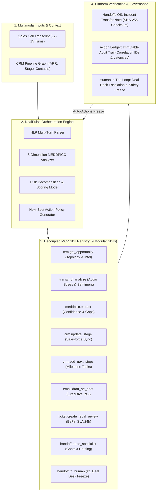

# DealPulse — Enterprise Deal-Risk Agent & Reusable MCP Fabric

> **Track 2: Platform Agent Skills & Knowledge**  
> *"Build skills once. Any agent can call them."*

DealPulse is an autonomous enterprise sales deal-risk orchestration platform. It ingests multi-speaker sales call transcripts and CRM pipeline context to extract 8 MEDDPICC qualification dimensions, detect hidden deal slippage risks, dispatch modular Model Context Protocol (MCP) skills, and generate cryptographically verifiable incident handoff packets.

---

## 🛑 The Problem

In enterprise B2B sales, over **$2.1 Trillion in pipeline value stalls or slips each quarter** due to three systemic organizational failures:

1. **Hidden Paper Process & Compliance Blockers**: Late-stage deals frequently blindside revenue teams when enterprise legal and security teams demand non-standard data residency (e.g., BaFin EU AWS Frankfurt clauses) or 5x liability caps days before month-end closing.
2. **Unengaged Economic Buyers**: Account Executives mistake technical champions for budget holders. When procurement locks quarterly spend, deals collapse without executive sponsorship.
3. **Loss of Context in Sales Handoffs**: When an AE escalates a critical blocker to Legal, Security, or the Deal Desk, critical context is lost across informal Slack messages and unrecorded calls. There is no cryptographic audit trail or structured incident transfer protocol.

---

## 💡 The Solution

DealPulse solves enterprise deal slippage by pairing a **deterministic orchestration supervisor** with a **decoupled MCP skill fabric**:

- **Autonomous 8-Dimension MEDDPICC Extraction**: Continuously parses multi-speaker sales conversations (12–15 turns) and evaluates Metrics, Economic Buyer, Decision Criteria, Decision Process, Paper Process, Implicate Pain, Champion, and Competition.
- **Decoupled MCP Skill Registry (`src/mcp/registry.ts`)**: 9 modular, reusable tools conforming to the Model Context Protocol standard (`crm.get_opportunity`, `transcript.analyze`, `meddpicc.extract`, `crm.update_stage`, `crm.add_next_steps`, `email.draft_ae_brief`, `ticket.create_legal_review`, `handoff.route_specialist`, `handoff.to_human`).
- **Verifiable Handoffs OS & Incident Transfer**: Compiles tamper-evident handoff packets with SHA-256 checksums, verbatim transcript citations, prior decisions, and open questions to guarantee zero context loss between primary agents, specialists, and human executives.
- **Immutable Action Ledger**: Every skill execution records correlation IDs, millisecond latencies, input payloads, and output schemas to maintain a strict audit trail.
- **Deterministic Heuristics with Optional Gemini Enrichment**: 100% offline and deterministic by default for fast, reliable demo execution, with optional Gemini flash integration for dynamic natural language chat phrasing.

---

## 🏗️ System Architecture



### Core Architecture Components

1. **Decoupled MCP Skill Registry (`src/mcp/registry.ts`)**: 9 modular, reusable skills conforming to MCP schema specifications (`crm`, `analysis`, `comms`, `compliance`, `orchestration`).
2. **Deterministic Orchestrator (`src/engine/orchestrator.ts`)**: Autonomous deal supervisor that executes multi-step diagnostic pipelines across sales data with zero external runtime dependencies.
3. **Action Ledger**: Immutable audit log recording correlation IDs, millisecond latencies, inputs, and outputs for every tool invocation.
4. **Handoffs OS & Incident Transfer**: Verifiable agent-to-specialist-to-human handoff packets featuring SHA-256 checksums, verbatim evidence quotes, MEDDPICC gaps, and a safety-freeze "Escalate to Human" control.

---

## 🎬 2-Minute Demo Script (Evaluator Walkthrough)

Follow these steps for a complete evaluation of DealPulse:

1. **Select Scenario B**: In the top navigation bar, ensure **"Scenario B: Late-stage legal block (High Risk - $350k)"** is selected.
2. **Execute Autonomous Orchestration**: Click **"Run Demo"** in the header.
   - Observe the live execution progress bar and real-time chat messages as the orchestrator dispatches `crm.get_opportunity`, `transcript.analyze`, `meddpicc.extract`, and `legal.generate_addendum`.
   - Watch the Deal Risk Score dynamically update from 18 to 84 (Critical).
3. **Inspect MEDDPICC Gaps**: In the center panel, view the 8 scored dimensions and click on **Critical Gaps** to see the missing Paper Process redline.
4. **Explore the MCP Skills Registry**: In the right panel, open the **MCP Skills** tab. Click any skill card (e.g. `legal.generate_addendum` or `meddpicc.extract`) to view its formal MCP schema and inspect its live input/output payload recorded in the ledger.
5. **Audit Handoffs OS & Escalate to Human**: Switch to the **Handoffs OS** tab.
   - Review the verified SHA-256 Checksum, verbatim Evidence Quotes, and MEDDPICC Gaps in the **Incident Transfer Note**.
   - Click the **"Escalate to Human"** button. Notice how a human executive node is appended, the Action Ledger records the event, and autonomous actions are frozen to prevent unauthorized edits.
6. **Verify Action Ledger**: Switch to the **Action Ledger** tab to audit the full log of executed skills, correlation IDs, and millisecond latencies.
7. **Test Scenario A**: Switch the scenario dropdown to **Scenario A ($185k ARR)** and observe the dynamic recalculation of MEDDPICC dimensions and unengaged Economic Buyer risks.

---

## 🗺️ Stage-2 Plan & Roadmap

| Milestone | Capability | Description |
| :--- | :--- | :--- |
| **Stage 2.1** | **Freshworks MCP & Agent Studio** | Native integration with Freshsales CRM and Freshservice deal desk workflows. Automated pipeline hygiene bots and SLA escalation triggers. |
| **Stage 2.2** | **ElevenLabs AE Voice Briefs** | Synthesize 60-second audio pre-call briefings for Account Executives highlighting active MEDDPICC gaps and objection talking points. |
| **Stage 2.3** | **Bi-Directional MCP Server Endpoints** | Expose DealPulse MCP skills over JSON-RPC HTTP/SSE for external agent clients (Claude Desktop, Cursor, Copilot). |
| **Stage 2.4** | **Live CRM & Conversational Connectors** | Live two-way synchronization with Salesforce, HubSpot, and Gong/Chorus call recording webhooks. |
| **Stage 2.5** | **Automated Ground Truth Evals** | Continuous benchmark evaluation suite testing LLM MEDDPICC extraction precision and hallucination suppression across 500+ enterprise deals. |

---

## 🚀 Run Locally

DealPulse is built as a pure client-side SPA (Vite + React 19 + TypeScript + Tailwind CSS). It requires **no server** for the Stage-1 demo.

### Prerequisites
- Node.js 18+ or 20+
- npm

### Step-by-Step
```bash
# 1. Clone the repository
git clone https://github.com/anishreddy3/dealpulse.git
cd dealpulse

# 2. Install dependencies
npm install

# 3. (Optional) Configure Gemini API key for dynamic phrasing
# Create .env:
# VITE_GEMINI_API_KEY=your_gemini_api_key_here
# If omitted, DealPulse runs seamlessly in 100% offline deterministic mode!

# 4. Start local development server
npm run dev

# 5. Open http://localhost:3000 in your browser
```

---

## ☁️ Deploy to Cloudflare Pages

DealPulse compiles to static HTML/JS/CSS, making it natively compatible with **Cloudflare Pages** with zero configuration.

### Option A: Cloudflare Dashboard (Git Integration)
1. Go to the **Cloudflare Dashboard** → **Workers & Pages** → **Create application** → **Pages** → **Connect to Git**.
2. Select your `dealpulse` repository.
3. Configure Build Settings:
   - **Framework preset**: `Vite`
   - **Build command**: `npm run build`
   - **Build output directory**: `dist`
   - **Root directory**: `/`
4. Click **Save and Deploy**.

### Option B: Cloudflare Wrangler CLI (Direct Upload)
```bash
# 1. Build the production bundle
npm run build

# 2. Deploy directly to Cloudflare Pages
npx wrangler pages deploy dist --project-name=dealpulse
```
